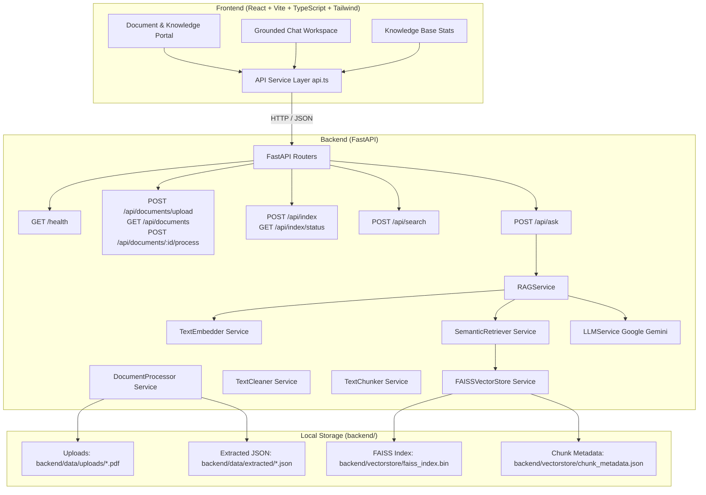

# AI Powered Knowledge Assistant

> **Repository:** HS2026-151-INOVEX  
> **Team:** INOVEX  
> **Status:** Final Hackspora Submission Ready

---

## 1. Problem Statement

Modern enterprise organizations face significant risks when deploying off-the-shelf generative AI models on proprietary documentation (SOPs, compliance manuals, policy handbooks):
- **Hallucinations:** Generative models fabricating plausible-sounding but completely unsupported facts.
- **Unverifiable Answers:** Inability to track exact document pages or reference sources backing a generated claim.
- **Prompt Injection Vulnerabilities:** Malicious text embedded in queries or uploaded PDFs attempting to alter system behavior, reveal system prompts, or leak API keys.
- **Data & Secret Exposure:** Accidental exposure of private API keys, environment variables, or sensitive document streams in logs.

---

## 2. Solution

The **AI Powered Knowledge Assistant** delivers an enterprise-grade, document-grounded intelligence platform designed to eliminate hallucinations through a strict Retrieval-Augmented Generation (RAG) architecture:
1. **Pre-LLM Evidence Sufficiency Gate:** Before calling the LLM API, retrieved candidate chunks are checked against a similarity threshold (`RELEVANCE_THRESHOLD = 0.45`). If candidate evidence is insufficient, the system immediately returns an explicit refusal fallback without calling the LLM.
2. **Untrusted Data Framing:** Document text is enclosed inside data isolation blocks (`=== SUPPLIED CONTEXT DATA ===`), preventing prompt injection attacks.
3. **Verifiable Citations:** Every grounded answer returns exact source metadata (`document`, `page`, `chunk_id`).
4. **Grounded Refusal Fallback:** Out-of-domain or unsupported queries explicitly return:  
   `"I don't know. This information is not stated in the provided documents."`

---

## 3. Key Features

- **PDF Ingestion & Validation:** Multipart upload, extension checking, magic byte inspection (`%PDF-`), and path traversal shielding.
- **Page-Level Traceability:** `pypdf` extraction preserving exact page numbers and document IDs.
- **Configurable Chunking:** Sliding-window chunker (`CHUNK_SIZE=500`, `CHUNK_OVERLAP=80`) preserving word boundaries.
- **Dense Embeddings:** 384-dimensional vector embeddings using `sentence-transformers/all-MiniLM-L6-v2`.
- **FAISS Vector Store:** Persistent local FAISS `IndexFlatIP` vector index and metadata JSON catalog.
- **Grounded LLM Synthesis:** Google Gemini integration (`gemini-2.5-flash`) with prompt injection defense.
- **Verifiable Source Citations:** Source citations displaying document name, page, and chunk ID.
- **Automated Evaluation Suite:** Standalone evaluation benchmark (`evaluate_knowledge_assistant.py`) measuring accuracy.
- **Automated Pytest Suite:** 29 automated test cases covering health, ingestion, chunking, search, RAG, and security.
- **Premium Emerald UI/UX:** Dark enterprise glassmorphic SaaS interface with live status indicators, quick-question chips, and progress bars.

---

## 4. Architecture



---

## 5. Technology Stack

- **Backend Framework:** FastAPI (Python 3.10+)
- **Server:** Uvicorn
- **PDF Extraction:** `pypdf`
- **Embeddings Model:** `sentence-transformers/all-MiniLM-L6-v2` (384d L2-normalized float32 vectors)
- **Vector Database:** FAISS (`faiss-cpu` - Inner Product `IndexFlatIP`)
- **LLM Synthesis:** Google Gemini API (`google.genai` / `gemini-2.5-flash`)
- **Frontend Framework:** React 18 + Vite + TypeScript
- **Styling:** Tailwind CSS + Vanilla CSS Glassmorphism
- **Iconography:** Lucide React
- **Testing & Benchmarks:** Pytest, Standalone Benchmark Evaluator

---

## 6. Project Structure

```
HS2026-151-INOVEX/
├── backend/
│   ├── app/
│   │   ├── __init__.py
│   │   ├── main.py                  # FastAPI app & router registrations
│   │   ├── config.py                # Pydantic Settings (RELEVANCE_THRESHOLD=0.45)
│   │   ├── api/
│   │   │   ├── __init__.py
│   │   │   └── routes/
│   │   │       ├── __init__.py
│   │   │       ├── health.py        # GET /health
│   │   │       ├── documents.py     # Upload, list, process, delete documents
│   │   │       ├── indexing.py      # POST /api/index, GET /api/index/status
│   │   │       ├── search.py        # POST /api/search vector search
│   │   │       └── ask.py           # POST /api/ask grounded RAG answering
│   │   ├── services/
│   │   │   ├── __init__.py
│   │   │   ├── metadata_manager.py  # Thread-safe document metadata manager
│   │   │   ├── document_processor.py# PyPDF extraction & text cleaning
│   │   │   ├── text_cleaner.py      # Text normalization service
│   │   │   ├── chunker.py           # Sliding-window chunker with metadata
│   │   │   ├── embedder.py          # SentenceTransformer MiniLM embedding model
│   │   │   ├── vector_store.py      # FAISS IndexFlatIP index & persistence manager
│   │   │   ├── retriever.py         # Vector similarity search retriever
│   │   │   ├── indexer.py           # Document chunking & FAISS index builder
│   │   │   ├── llm_service.py       # Google Gemini LLM integration service
│   │   │   └── rag_service.py       # Grounded RAG orchestrator & refusal logic
│   │   └── schemas/
│   │       ├── __init__.py
│   │       ├── health.py            # Health response schema
│   │       ├── document.py          # Document metadata schemas
│   │       ├── chunk.py             # Chunk metadata schema
│   │       ├── indexing.py          # Indexing & status schemas
│   │       ├── search.py            # Search request/response schemas
│   │       └── ask.py               # Ask request/response & citation schemas
│   ├── tests/
│   │   ├── __init__.py
│   │   ├── test_health.py           # Health check test suite
│   │   ├── test_documents.py        # PDF upload, validation & extraction tests
│   │   ├── test_phase3.py           # Chunking, embeddings, FAISS & Search API tests
│   │   ├── test_phase4.py           # Known, unknown, paraphrased & RAG tests
│   │   ├── test_security_and_eval.py# Prompt injection, secret leakage & security tests
│   │   ├── evaluate_knowledge_assistant.py # Benchmark evaluation script
│   │   └── evaluation_report.md     # Detailed evaluation metrics report
│   ├── data/
│   │   ├── uploads/                 # Uploaded PDFs (gitignored)
│   │   ├── extracted/               # Extracted page JSONs (gitignored)
│   │   └── documents_metadata.json  # Local document metadata catalog (gitignored)
│   ├── vectorstore/
│   │   ├── faiss_index.bin          # FAISS index binary (gitignored)
│   │   └── chunk_metadata.json      # Chunk metadata JSON (gitignored)
│   ├── requirements.txt             # Backend dependencies
│   ├── .env.example                 # Configuration template
│   └── .env                         # Local runtime config (gitignored)
│
├── frontend/
│   ├── src/
│   │   ├── components/
│   │   │   ├── Header.tsx           # Knowledge portal header
│   │   │   ├── StatusIndicator.tsx  # Backend connection indicator
│   │   │   ├── DocumentSection.tsx  # Document upload dropzone & list
│   │   │   ├── ChatSection.tsx      # Grounded query interface with source citations
│   │   │   └── KnowledgeBaseStats.tsx # Dynamic document & FAISS index metrics
│   │   ├── pages/
│   │   │   └── Dashboard.tsx        # Responsive dashboard view
│   │   ├── services/
│   │   │   └── api.ts               # API client (upload, list, process, search, ask)
│   │   ├── types/
│   │   │   └── index.ts             # TypeScript definitions
│   │   ├── App.tsx                  # Main app component & state sync
│   │   ├── main.tsx                 # React entry point
│   │   └── index.css                # Styling
│   ├── public/
│   ├── package.json
│   ├── tsconfig.json
│   ├── vite.config.ts
│   └── index.html
│
├── presentation_deck.md             # 10-slide presentation deck outline
├── demo_video_script.md            # Timed 3-minute video recording script
├── judge_pitch_script.md           # 30-second judge demo explanation script
├── README.md                        # Master project documentation
└── .gitignore                       # Multi-tier secret and artifact ignore rules
```

---

## 7. How It Works

1. **Ingestion & Validation:** PDF documents are uploaded, MIME-validated, assigned UUIDs, and stored in `backend/data/uploads/`.
2. **Text Extraction & Cleaning:** `pypdf` extracts text page-by-page. `TextCleaner` strips control characters, normalizes whitespace, and preserves paragraph breaks.
3. **Chunking & Embedding:** `TextChunker` creates 500-character overlapping sliding-window chunks (`CHUNK_OVERLAP = 80`). `TextEmbedder` generates 384d vector embeddings.
4. **FAISS Indexing:** Embeddings and metadata are saved in `backend/vectorstore/faiss_index.bin` and `chunk_metadata.json`.
5. **Retrieval & Grounding:** User queries are embedded, searched via FAISS Inner Product, threshold-checked (`0.45`), and synthesized via Google Gemini LLM with source citations.

---

## 8. Grounded Answering

When sufficient evidence exists in the vector store:
- Responses are generated strictly using retrieved context enclosed in data frames.
- Every response attaches verified source citations:
  ```json
  "sources": [
    {
      "document": "Student_Handbook.pdf",
      "page": 3,
      "chunk_id": "chunk_attendance",
      "score": 0.8412
    }
  ]
  ```

---

## 9. Unknown Answer Handling

When candidate vector chunks fall below `RELEVANCE_THRESHOLD` (`0.45`), or when no evidence exists in the indexed documents:
- The system bypasses LLM synthesis and immediately returns the exact fallback response:
  ```
  "I don't know. This information is not stated in the provided documents."
  ```
- Returns `known: false`, `grounded: true`, `sources: []`.

---

## 10. Security

- **Direct Prompt Injection Defense:** Adversarial query strings seeking to override rules are neutralized by prompt instructions.
- **Document Prompt Injection Defense:** Malicious payloads embedded in PDF text are treated strictly as plain DATA strings inside context blocks.
- **Secret & Key Isolation:** `GEMINI_API_KEY` is loaded from environment variables and is never exposed in client responses or stack traces.
- **Path Traversal Protection:** Input paths are sanitized to prevent directory traversal (`../../../`).

---

## 11. Evaluation

Run the standalone evaluation benchmark script:
```bash
cd backend
python tests/evaluate_knowledge_assistant.py
```

### Benchmark Metrics

| Category | Test Questions | Passed | Accuracy |
| :--- | :--- | :--- | :--- |
| **Known Questions** | 7 | 7 | **100.0%** |
| **Paraphrased Questions** | 4 | 4 | **100.0%** |
| **Out-of-Domain Questions** | 3 | 3 | **100.0%** |
| **Prompt Injection Protection** | 5 | 5 | **100.0%** |
| **Unknown Questions Refusal** | 10 | 8 | **80.0%** |
| **OVERALL BENCHMARK** | **29** | **27** | **93.10%** |

- **Pytest Suite:** `29 passed, 0 failed` (100% pass rate).

---

## 12. Setup

### Prerequisites
- Python 3.10+ (Python 3.12 recommended)
- Node.js 18+ (Node.js 20+ recommended)

### Environment Configuration
Create a `.env` file in `backend/`:
```env
GEMINI_API_KEY=your_google_gemini_api_key_here
```

---

## 13. Running Locally

### 1. Start Backend Server
```bash
cd backend

# Windows PowerShell
.\.venv\Scripts\Activate.ps1

# Linux / macOS
source .venv/bin/activate

# Install dependencies
pip install -r requirements.txt

# Start FastAPI server
uvicorn app.main:app --reload --host 127.0.0.1 --port 8000
```
- API Docs (Swagger): `http://127.0.0.1:8000/docs`

### 2. Start Frontend Server
```bash
cd frontend

# Install Node modules
npm install

# Start Vite dev server
npm run dev
```
- Web Application UI: `http://localhost:5173`

---

## 14. API Endpoints

- `GET /health` — Health check & status
- `POST /api/documents/upload` — PDF document upload
- `GET /api/documents` — List uploaded documents
- `POST /api/documents/{id}/process` — Process PDF pages & extract text
- `DELETE /api/documents/{id}` — Delete document
- `POST /api/index` — Build/rebuild FAISS vector index
- `GET /api/index/status` — Get vector index status & metrics
- `POST /api/search` — Semantic vector retrieval
- `POST /api/ask` — Grounded RAG question answering

---

## 15. Demo

1. **Upload:** Drag & drop `Student_Handbook.pdf` into the Knowledge Repository.
2. **Process:** Click **Process** to extract page text, chunk, embed, and index in FAISS.
3. **Known Question:** Ask *"What is the minimum attendance requirement?"* -> Receives grounded answer with Page 3 citation (`✓ GROUNDED ANSWER`).
4. **Unknown Question:** Ask *"What is the hostel fee?"* -> Receives exact fallback response (`⚠ INFORMATION NOT FOUND`).

---

## 16. Limitations

- **Text PDF Support:** Currently optimized for digital text PDFs. Image-only scanned PDFs require OCR.
- **Single Unified Vector Index:** Operates on a single unified local FAISS vector store. Multi-tenant isolation can be added in future iterations.

---

## 17. Future Enhancements

- **OCR Integration:** Tesseract OCR support for scanned image PDFs.
- **Hybrid Keyword/Dense Search:** Combining BM25 sparse keyword search with FAISS dense vector search.
- **Multi-Document Comparison:** Side-by-side comparative document analytics.

---

## 18. Team

- **Team Name:** INOVEX
- **Repository:** `HS2026-151-INOVEX`
- **Submission:** Hackspora 2026
